+++
title = 'Node-red'
date = 2024-03-05T18:19:09+08:00
draft = false
+++

### Install and Run

* Go to the Docker menu and install Node-red, if it is not there, click the add button to add.
* Click the RUN button to run the Node-red, keep parameters default.

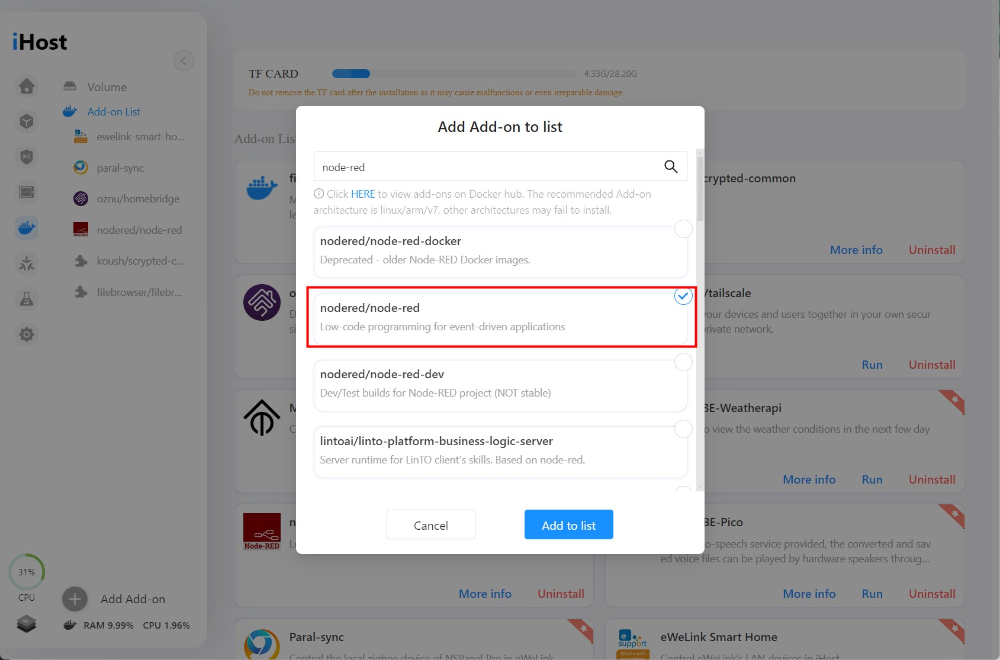

### Open the webUI of Node-red
* After running, click the 'More info' to go to its detail page.
* Click the 'Show in new window' button upper right to open its web console on a new tab.

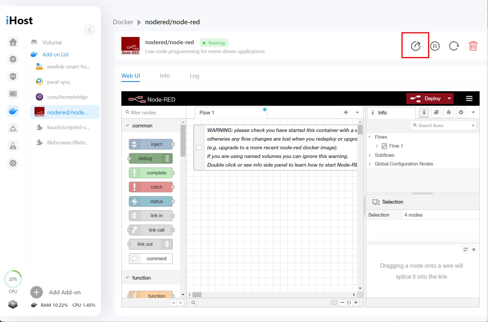

### Install the ewelink-cube palette
* On the Node-red page, click the menu upper right, click 'Manage palette'.
* Switch to 'Install' tab and search for 'ewelink-cube', install the 'node-red-contrib-ewelink-cube'.

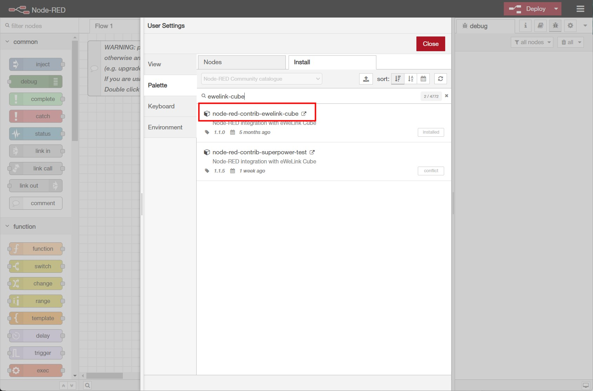

### Get iHost access token
* Drag and drop the 'get-devices' node and 'debug' node, connect them.
* Double click on the 'get-devices' to edit.

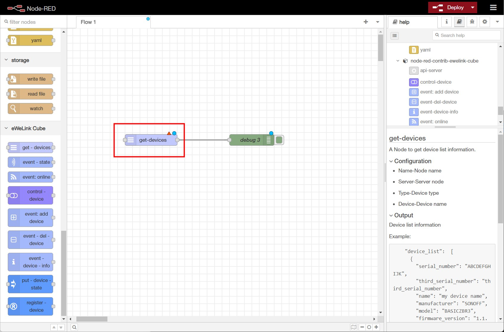

* Click the edit button to add a new server.

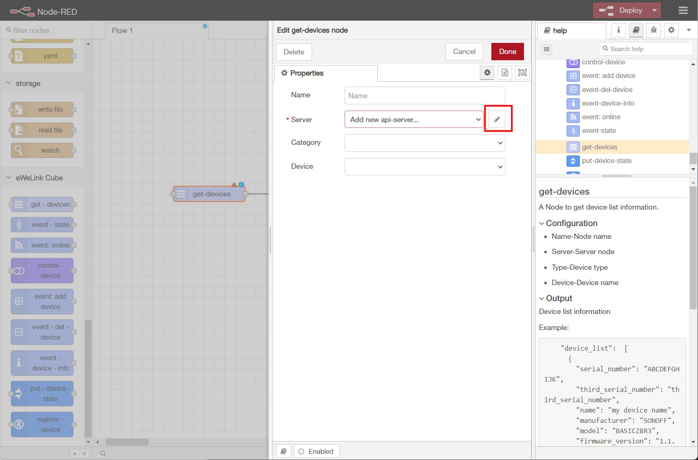

* Enter your iHost IP and click the search button, then click 'GET TOKEN'

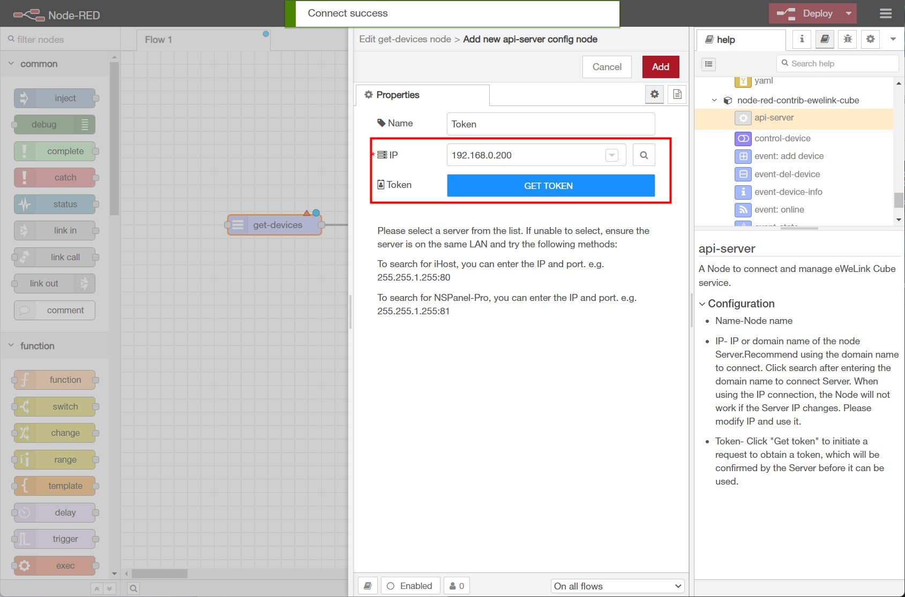

* Go back to iHost page and Click Allow.

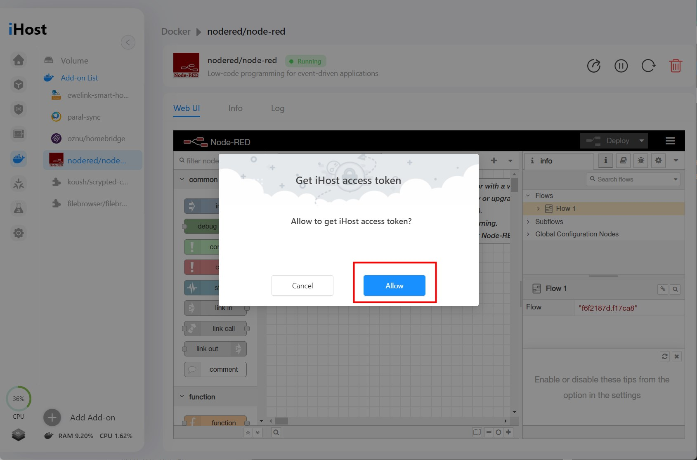

* Click Add and select All device, save the settings.

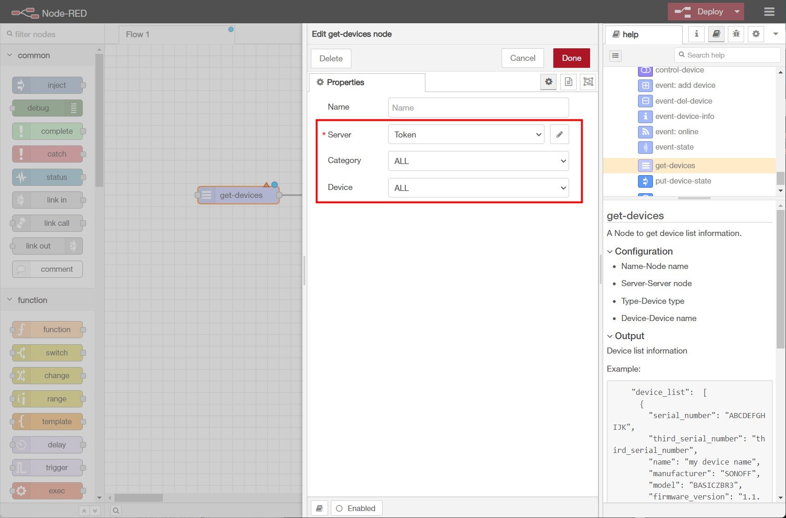

* Add an 'inject' node and click the Deploy button upper right.

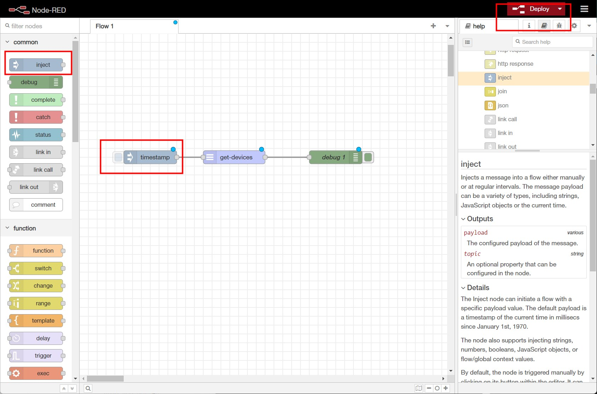

* Click on the inject node and you'll see the output under debug tab.

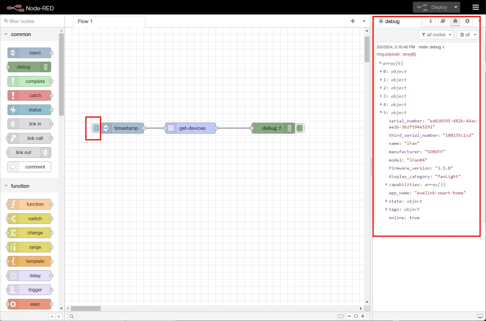

* For other nodes, you can switch to the info tab to check the description.

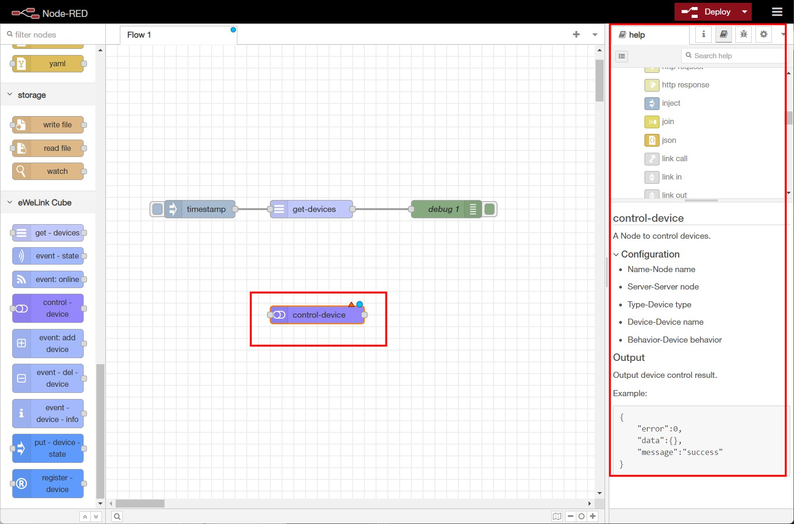

